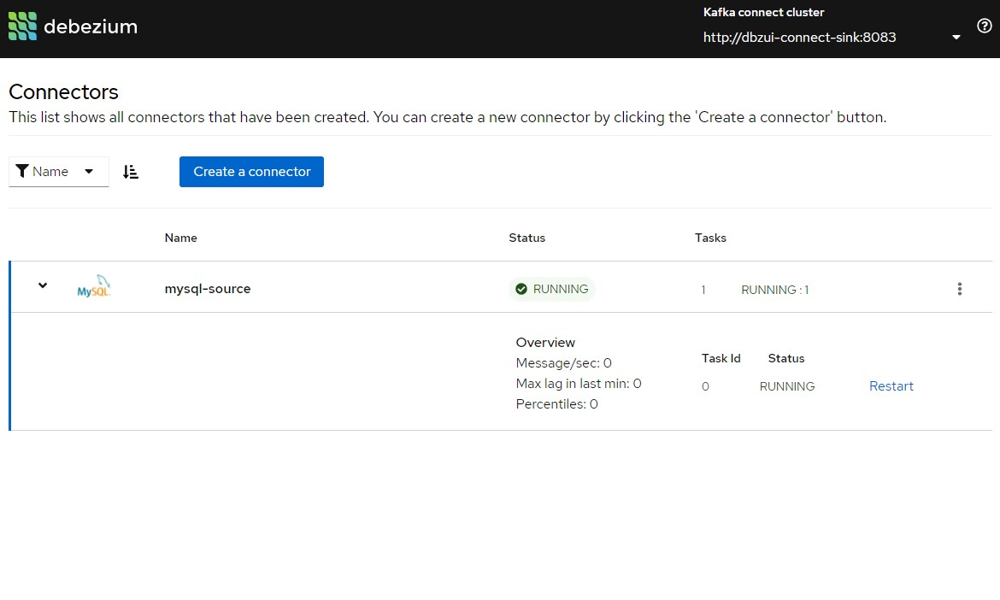
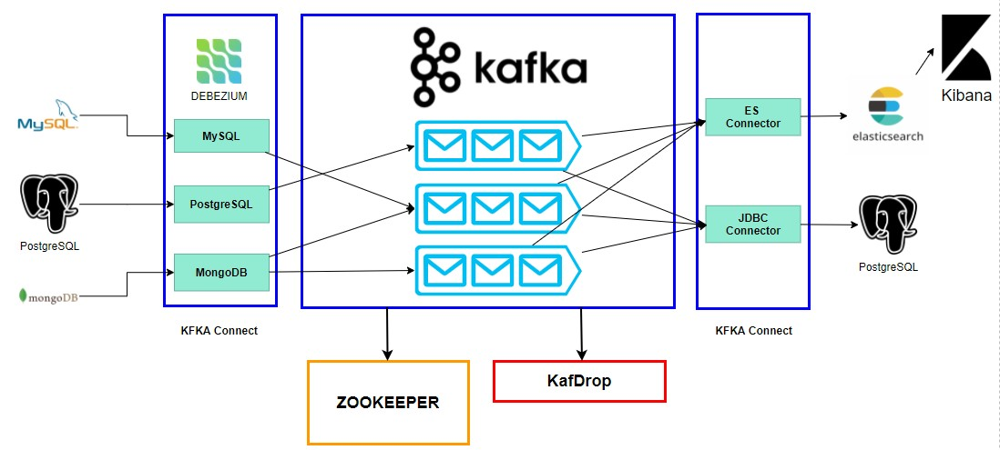

[](http://www.apache.org/licenses/LICENSE-2.0.html)
[](http://search.maven.org/#search%7Cga%7C1%7Cg%3A%22io.debezium%22)
[](https://travis-ci.com/debezium/debezium-connector-vitess/)
[](https://gitter.im/debezium/user)
[](https://gitter.im/debezium/dev)
[](https://groups.google.com/forum/#!forum/debezium)
[](http://stackoverflow.com/questions/tagged/debezium)

Copyright Debezium Authors.
Licensed under the [Apache License, Version 2.0](http://www.apache.org/licenses/LICENSE-2.0).

# Debezium UI




Debezium is an open source distributed platform for change data capture (CDC).

This repository contains a web-based UI for Debezium, allowing to configure Debezium connectors in an intuitive way, control their lifecycle, and more.
The Debezium UI is a standalone web application, which connects to Kafka Connect via its REST API.

#### Architecture


```
        +----------------+     +-------------------+
        |                |     |                   |
        |   PostgreSQL   |     |       MySQL       |
        |                |     |                   |
        +-------|--------+     +--------|----------+ 
                |                       |
                |                       |
                |                       | 
          +-----v-----------------------v----+
          |                                  |
          |           Kafka Connect          |
          |  (Debezium, JDBC, ES connectors) |
          |                                  |
          +---+-----------------------+------+
              |                       |
              |                       |
              |                       |
              |                       |
+-------------v--+                +---v---------------+
|                |                |                   |
|   PostgreSQL   |                |   ElasticSearch   |
|                |                |                   |
+----------------+                +-------------------+

```

## Prerequisites

Debezium UI needs a properly running Debezium instance version 1.4.0.Beta1 or newer and running DB instances, depending
on what connectors you are going to use (Postgres, Mongo DB, MySQL, etc).

### DEV Infrastructure with Docker-Compose

You can setup a running DEV infrastructure with Zookeeper, Kafka, Debezium, Postgres Source, 
Postgres-2, Mongo DB, KafDrop using docker-compose:

How to run:
```
## optionally make sure you have the latest images:
$ docker-compose pull

Pulling dbzui-zookeeper ... done
Pulling dbzui-db-mongo  ... done
Pulling dbzui-db-mysql  ... done
Pulling debezium-ui_mongo-initializer_1 ... done
Pulling dbzui-kafka     ... done
Pulling dbzui-db-pg     ... done
Pulling dbzui-db-pg-2   ... done
Pulling dbzui-connect   ... done
Pulling dbzui-kafdrop   ... done
Pulling dbzui-elastic   ... done
Pulling dbzui-connect-sink  ... done

## start containers
$ docker-compose up -d

Creating dbzui-db-mysql  ... done
Creating dbzui-db-pg     ... done
Creating dbzui-zookeeper ... done
Creating dbzui-db-mongo  ... done
Creating debezium-ui_mongo-initializer_1 ... done
Creating dbzui-kafka     ... done
Creating dbzui-connect   ... done
Creating dbzui-kafdrop   ... done
Creating dbzui-elastic   ... done
Creating dbzui-connect-sink  ... done
```

Open a Terminal and run
This will init all destination sources, Elastic Cache and PostgreSQL 
```
debezium-jdbc-es/init-destinations.sh
```
This will init all sources 3 SQL and 1 Postgres
```
debezium-jdbc-es/init-sources.sh
```

Alternative you can init each service at the time
Start Elasticsearch connector
```
curl -i -X POST -H "Accept:application/json" -H  "Content-Type:application/json" http://localhost:8083/connectors/ -d @debezium-jdbc-es/es-sink.json
```
Start PostgreSQL connector
```
curl -i -X POST -H "Accept:application/json" -H  "Content-Type:application/json" http://localhost:8083/connectors/ -d @debezium-jdbc-es/jdbc-sink.json
```
Start MySQL-Source connector
```
curl -i -X POST -H "Accept:application/json" -H  "Content-Type:application/json" http://localhost:8083/connectors/ -d @debezium-jdbc-es/mysql-source.json
curl -i -X POST -H "Accept:application/json" -H  "Content-Type:application/json" http://localhost:8083/connectors/ -d @debezium-jdbc-es/mysql2-source.json
curl -i -X POST -H "Accept:application/json" -H  "Content-Type:application/json" http://localhost:8083/connectors/ -d @debezium-jdbc-es/mysql3-source.json
```
Start PostgreSQL-Source connector
```
curl -i -X POST -H "Accept:application/json" -H  "Content-Type:application/json" http://localhost:8083/connectors/ -d @debezium-jdbc-es/postgres-source.json
```
Delete Connector
```
curl -X DELETE http://localhost:8083/connectors/jdbc-sink
```


Debezium UI will be available on [http://localhost:8080](http://localhost:8080)      
Kafdrop will be available on [http://localhost:9000](http://localhost:9000)      

Kafka Connect REST API with Debezium will be available on localhost port **8083**.   
Kafka will be available on localhost port **9092**.  
Postgres will be available on localhost port **65432**.  
MySQL will be available on localhost port **63306**.  
Mongo DB will be availaible after ~20 seconds on localhost port **37017**.  
Connect via (`mongo -u debezium -p dbz --authenticationDatabase admin localhost:37017/inventory`).

Verify that Elasticsearch has the same content: 
[http://localhost:9200/customers/_search?pretty](http://localhost:9200/customers/_search?pretty)
Kibana dashboard
[http://localhost:5601/](http://localhost:5601/)


```
## later stop containers:
$ docker-compose down

Stopping dbzui-connect   ... done
Stopping dbzui-kafka     ... done
Stopping dbzui-zookeeper ... done
Stopping dbzui-db-mongo  ... done
Stopping debezium-ui_mongo-initializer_1 ... done
Stopping dbzui-db-pg     ... done
Stopping dbzui-db-mysql  ... done
Stopping dbzui-kafdrop   ... done
Removing dbzui-connect   ... done
Removing dbzui-kafka     ... done
Removing dbzui-zookeeper ... done
Removing dbzui-db-mongo  ... done
Removing debezium-ui_mongo-initializer_1 ... done
Removing dbzui-db-pg     ... done
Removing dbzui-db-mysql  ... done
Removing dbzui-kafdrop   ... done
Removing network debezium-ui_dbzui-network

```

## Build
The entire application (UI and backend) can be built via Maven:
```
mvn clean install
```
The UI part is an SPA application based on the React framework. It is packaged as JAR,
whose contents are then exposed by the Quarkus-based backend application.
### Backend
The UI backend is a Quarkus application located under _backend_.
You can run it in development mode like so:
```
mvn -pl backend compile quarkus:dev
```

Swagger UI can be accessed from:  [http://localhost:8080/swagger-ui/](http://localhost:8080/swagger-ui/)

**NOTE:**
Launching the backend via the mvn command above will utilize the existing frontend UI jar.  
The UI will be available at: [http://localhost:8080/](http://localhost:8080/).  
If you have local frontend changes which need to be included, you can rebuild just the frontend first like so: 

```
mvn -pl ui install
```

### UI Development

The UI frontend code is located under the _ui_ folder.  See the [UI README](./ui/README.md) for more information about UI development.

## Contributing

The Debezium community welcomes anyone that wants to help out in any way, whether that includes
reporting problems, helping with documentation, or contributing code changes to fix bugs, add tests,
or implement new features.
See [this document](https://github.com/debezium/debezium/blob/master/CONTRIBUTE.md) for details.
